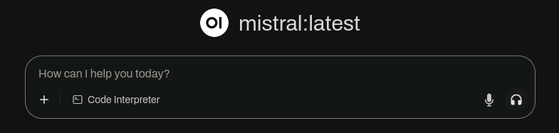
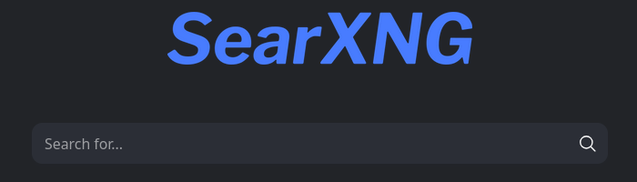

# Local AI

Local AI provides a fully self-hosted AI stack for private, local language model inference and search.

## Overview

This repository integrates three primary software components:

1. **Ollama** – Local large language model serving.
2. **SearXNG** – Privacy-focused, anonymized search engine.
3. **Open WebUI** – User-friendly chat interface for interaction.

## Instructions

### Install Required Packages

#### Docker

```bash
sudo <package-manager> docker{,-compose}
```

#### Ollama

*Install/Update*

```bash
curl -fsSL https://ollama.com/install.sh | sh
```

### System Services and Permissions

Following [this tutorial](https://docs.docker.com/engine/install/linux-postinstall/),

```bash
sudo systemctl start docker
sudo systemctl enable docker
sudo groupadd docker
sudo usermod -aG docker $USER
newgrp docker # activate changes
```

*Optional test:*

```bash
docker run hello-world
```

### Donwload Repository

```bash
git clone https://github.com/MGross21/local-ai
cd local-ai
```

### Starting up AI

>[!Warning]
> Pulling images may take some time <br>
> **Total Download: ~10G** (~5G Docker + ~5G Model)

```bash
ollama pull mistral # 7b param model
```

[See other models here](https://ollama.com/library?sort=popular)

```bash
docker compose up -d
```

### Opening Stack

| Service         | URL/Port                | Preview                      |
|-----------------|------------------------|----------------------------------|
| Web UI          | [http://localhost:3000/](http://localhost:3000/) |  |
| SearXNG         | [http://localhost:8080/](http://localhost:8080/) |        |
| Ollama API      | [http://localhost:11434/](http://localhost:11434/) |           `Ollama is running`                       |

### Shutdown

```bash
docker compose down
```
